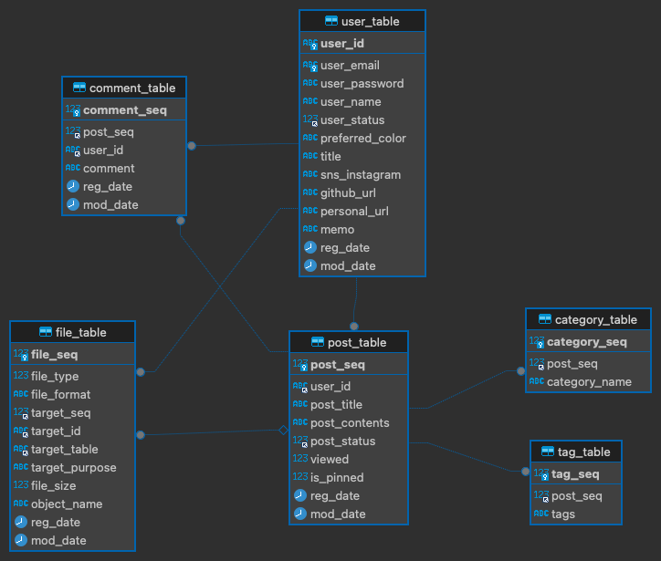

# back

## Note

### 추가 2024.2.22.

- 로그인이 필요한 모든 기능들은 로그인 시 응답으로 전달 된 인코딩 된 email 값을 요청에 넣고 진행한다.

- 모든 이미지들은 originalname에 랜덤 생성 문자열을 합친 유일 문자열을 기준으로 쿼리 / url 생성 됨
- 따라서 이미지 업로드 후 응답은, 페이지 상에 표시할 이미지 URL과 해당 이미지들의 원본 이름(originalName)
- 더 좋은 방법이 있다면 변경 예정

## Controllers

### /user

- /user/signup
    - 회원가입

- /user/login
    - 로그인

- /user/profile
    - 프로필 조회

### /post

- /post/list?page=1&size=10
    - 게시글 리스트 조회

- /post/contents
    - 게시글 상세 조회

- /post/list/pinned?page=1&size=10
    - 고정 게시글 리스트 조회

- /post/list/tag?page=1&size=10
    - 태그로 게시글 조회

- /post/list/category?page=1&size=10
    - 카테고리로 개시글 조회

- /post/category/list
    - 전체 카테고리 리스트 조회

### /admin

- 회원 계정으로 수행하는 기능들 (JWT 인증이 필요한 기능들)

- /admin/user/profile/update
    - 유저 프로필 업데이트

- /admin/user/profile/title
    - 블로그 타이틀 변경

- /admin/user/profile/color
    - 블로그 색상 변경

- /admin/post/register
    - 게시글 등록

- /admin/post/edit
    - 게시글 수정

- /admin/post/delete
    - 게시글 삭제

- /admin/post/update/pin
    - 게시글 고정으로 변경

- /admin/post/update/unpin
    - 개사굴 비고정으로 변경


## Request

### /posts

- register: HTTP Post
    - title: 게시글 제목 - string
    - post: 게시글 내용 - string
    - category: 게시글 카테고리 - string (optional), 최소 1글자, 최대 12글자
    - tag: 태그 - string array (optional)
    - imageUrl: 있을 경우 이미지 URL들 - string array (optional)
    - isPinned: 고정 게시글 여부 - boolean (optional)
    - isPublic: 공개 게시글 여부 - boolean (optional)

- delete: HTTP Post
    - email: 로그인 응답 값으로 준 인코딩 된 유저 email
    - postNumber: 게시글 번호
    - postUuid: 게시글 UUID

- get: HTTP Post
    - 특정 게시글 정보 가져오기
    - postNumber: 게시글 번호 - number

- edit: HTTP Post
    - postNumber: 게시글 번호 - number
    - email: 로그인 응답 값으로 준 인코딩 된 유저 email - string
    - postUuid: 게시글 UUID - string
    - title: 수정된 게시글 제목
    - editPost: 수정할 내용 - string
    - created: 잭성된 날짜 - string
    - category: 수정된 카테고리 - string (optional)
    - tag: 수정된 태그들 - string array (optional)
    - imageUrl: 있을 경우 이미지 URL들 - string array (optional)
    - isPinned: 고정 게시글 여부 - boolean (optional)
    - isPublic: 공개 게시글 여부 - boolean (optional)

- edit/pin: HTTP Post
    - email: 인코딩 된 이메일 값 - string
    - postNumber: 게시글 번호 - number
    - isPinned: 고정게시글 여부 - boolean

- lists: HTTP Get
     - 전체 게시글 리스트 가져오기
     - Query page (required), Query category(optional)

- lists/pin: HTTP Get
    - 고정 게시글 3개 가져오기

- lists/pin/all: HTTP Get
    - page - 페이지 번호 - number
    - 전체 고정 게시글 가져오기

- comment: HTTP Post
    - uuid: 유저 uuid
    - comment: 댓글 내용
    - postUuid: 게시글 UUID

- get/categories: HTTP Get
    - 카테고리 리스트 리턴

- category/:category: HTTP Get
    - 특정 카테고리에 해당하는 모든 게시글 불러오기
    - :category: 카테고리 이름 - string
    - page: 페이지 번호 - number, 요청 파라미터
    - 예시 - ~/category/KANGMINJE?page=2

- tag/:tag : HTTP Get
    - 게시글에서 태그 하나 클릭했을 때, 해당 태그를 가지고 있는 모든 게시글 가져오기
    - :tag: 태그이름(하나) - string
    - page: 페이지 번호 - number, 요청 파라미터
    - 예시 - ~/tag/dairy?page=2

### /users

- signup: HTTP Post
    - data: AES 방식 암호화.
    - 포함돠는 내용
        - email
        - name
        - password: 8~12 사이
    - 코드 예시

    ```js
        import CryptoJs from "crypto-js";
        
        const secretKey = process.env.CIPHER_KEY;

        // Assuming user data is in this format
        const userData = {
            username: 'john_doe',
            email: 'john.doe@example.com',
        // ... other user data
        };

        // Encrypt the user data
        const encryptedData = CryptoJS.AES.encrypt(JSON.stringify(userData), secretKey).toString();
    ```

- login: HTTP Post
    - data: AES 방식으로 암호화 된 email, password(8 ~ 12) - string
    - return: 인코딩 된 email

- logout: HTTP Post
    - email: 로그인 응답 값으로 준 인코딩 된 유저 email - string

- info: HTTP Post
    - email: 로그인 응답 값으로 준 인코딩 된 유저 email- string

- info/edit: HTTP Post
    - email: 로그인 응답 값으로 준 인코딩 된 유저 email - string
    - name: 유저 이름 - string, optional
    - memo: 한줄 메모 - string, optional
    - instagram: 인스타그램 링크 - string, optional
    - githubUrl: 깃허브 링크 - string, optional
    - personalUrls: 이외의 개인 링크들 - Array<string>, optional
    - profileImageName: 프로필 이미지 특수 이름 - string, optional

- color: HTTP Post
    - email: 인코딩 된 이메일 값
    - color: 색상 값 - string required

- search/email: HTTP  Post
    - name: 회원 가입 때 기입한 유저 이름

- search/password: HTTP Post
    - email: 원본 유저 이메일
    - name: 회원 가입 때 기입한 유저 이름

- search/password/validate: HTTP Post
    - tempKey: 메일로 전송 된 랜덤 키. 제한 시간은 3분
    - 응답: 암호화 된 비밀번호. 패스워드 변경 시 서버쪽으로 보내야할 이전 패스워드 값.

- search/password/change: HTTP Post
    - email: 원본 이메일
    - name: 유저 이름
    - password: 암호화 된 이전 패스워드
    - newPassword: 암호화 된 변경할 패스워드
    - 새로운 패스워드 암호화 예시

    ```js
        const secretKey = process.env.CIPHER_KEY;

        const bytes = CryptoJS.AES.encrypt(originalPassword, secretKey);
        const encryptedText = bytes.toString();
    ```

- change/password: HTTP Post
    - email: 인코딩 된 이메일
    - password: 이전 비밀번호
    - newPassword: 변경할 비밀번호

- change/title: HTTP Post
    - title: 변경할 제목
    - email: 인코딩된 이메일

### /upload

- image: FormData files

- profile
    - Headers {"Authorization": 인코딩 된 이메일}
    - FormData file

## ERD


<em>Client ERD</em>