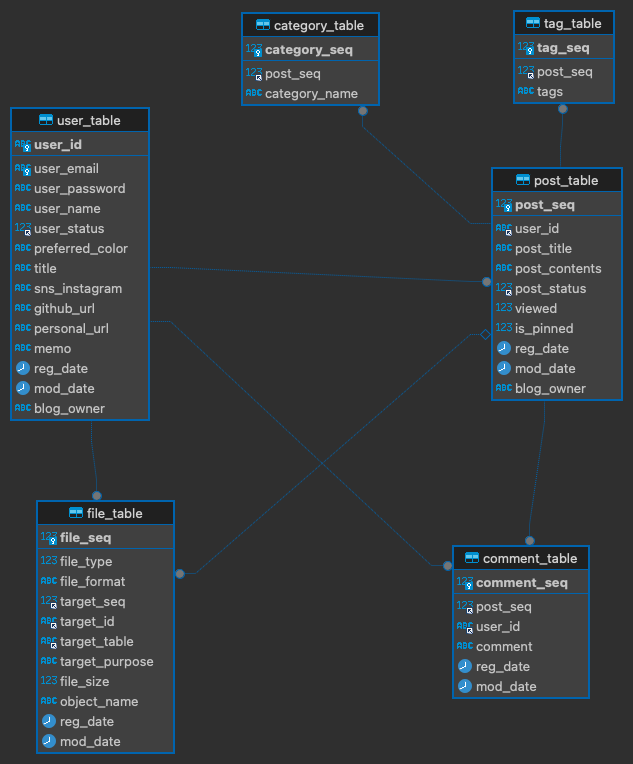

# back

## Note

### 추가 2024.2.22.

- 로그인이 필요한 모든 기능들은 로그인 시 응답으로 전달 된 인코딩 된 email 값을 요청에 넣고 진행한다.

- 모든 이미지들은 originalname에 랜덤 생성 문자열을 합친 유일 문자열을 기준으로 쿼리 / url 생성 됨
- 따라서 이미지 업로드 후 응답은, 페이지 상에 표시할 이미지 URL과 해당 이미지들의 원본 이름(originalName)
- 더 좋은 방법이 있다면 변경 예정

---

### 추가 2024.07.02

- 블로그 통합을 위한 수정
- 블로그 분리를 위한 blog_owner 칼럼 추가
- 블로그 ID 를 기준으로 데이터 입력, 업데이트, 조회
- 요청에 BlogId로 진행 및 JWT를 통한 관리

---

## ERD

<em>Client ERD</em>

---

## Controllers

### /user

- /user/signup
    - 회원가입

- /user/login
    - 로그인

- /user/profile
    - 프로필 조회

### /post

- /post/list?page=1&size=10
    - 게시글 리스트 조회

- /post/contents
    - 게시글 상세 조회

- /post/list/pinned?page=1&size=10
    - 고정 게시글 리스트 조회

- /post/list/tag?page=1&size=10
    - 태그로 게시글 조회

- /post/list/category?page=1&size=10
    - 카테고리로 개시글 조회

- /post/category/list
    - 전체 카테고리 리스트 조회

### /admin

- 회원 계정으로 수행하는 기능들 (JWT 인증이 필요한 기능들)

- /admin/user/profile/update
    - 유저 프로필 업데이트

- /admin/user/profile/title
    - 블로그 타이틀 변경

- /admin/user/profile/color
    - 블로그 색상 변경

- /admin/post/register
    - 게시글 등록

- /admin/post/edit
    - 게시글 수정

- /admin/post/delete
    - 게시글 삭제

- /admin/post/update/pin
    - 게시글 고정으로 변경

- /admin/post/update/unpin
    - 개사굴 비고정으로 변경

- /admin/upload/image/profile
    - 프로필 이미지 업로드

- /admin/upload/image/background
    - 프로필 배경 이미지 업로드

- /admin/upload/image/post
    - 게시글 이미지 업로드

## Crypt

- Encrypt
    - AES CBC
    - AES KEY: 32bytes
    - AES IV: 16bytes
    - Padding PKCS 7
    - Base64 Encoding

- Decrypt
    - AES CBC
    - AES KEY: 32bytes
    - AES IV: 16bytes
    - Unpadding PKCS 5
    - Base64 Decoding

- Password Encrypt
    - bcrypt
